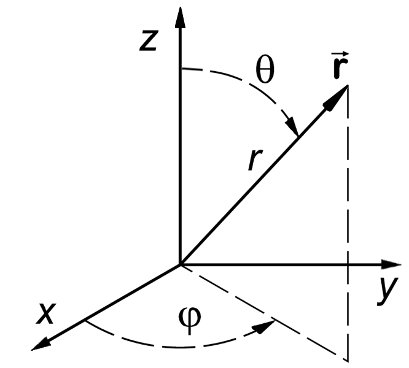

Homework 1
==========

Release Date: 
  2024/01/22

Due Date: 
  2024/01/29 23:59:59

Topic:
  Planetary Formation

Instruction
-----------

The format of the homework is constructed as the extension of the lecture.
In the homework, you will see familiar concepts that we have learned in the
lecture and some new concepts that we have not discussed formally in the lectures.
Some problems require single variable calculus including differentiation and
integration. You can use any programming language to solve the problems but ``Python``
is recommended. ``Python`` has a rich set of libraries for scientific computing
and visualization. You can use ``numpy`` for numerical computation and ``matplotlib``
for visualization. The ``sympy`` library can be useful for symbolic computation.

You are encouraged to work on the homework with your classmates. However, you
must write your own code and submit your own homework assignment. You are not
allowed to copy and paste the code from your classmates. You can consult AI tools
such as ``ChatGPT`` but you must make sure the code is working and produces the
correct results. You are fully responsible for the correctness of your code.

To allow us to grade your homework, you must submit both your calculation code and the 
written answers to ``Canvas`` in a combined ``PDF`` file. You code will be 
graded based on the style and your written answers will be graded based on the correctness.
(You will not be graded on the style for this homework assignment.)

.. _Solar Property Table:

Solar Property Table
--------------------

.. list-table::
    :header-rows: 1

    * - Property
      - Value
    * - Mass
      - :math:`1.989 \times 10^{30}` kg
    * - Radius
      - :math:`6.957 \times 10^8` m
    * - Luminosity
      - :math:`3.828 \times 10^{26}` W
    * - Effective Temperature
      - :math:`5772` K
    * - Rotation Period
      - :math:`25.38` days

.. _Planet Fact Sheet:

Planet Fact Sheet
-----------------

.. list-table::
    :header-rows: 1

    * - Planet
      - Mass (:math:`10^{24}` kg)
      - Distance from Sun (Au)
      - Orbital Period (days)
    * - Mercury
      - 0.3285
      - 0.387
      - 88
    * - Venus
      - 4.867
      - 0.723
      - 225
    * - Earth
      - 5.972
      - 1.000
      - 365
    * - Mars
      - 0.6390
      - 1.524
      - 687
    * - Jupiter
      - 1898
      - 5.204
      - 4333
    * - Saturn
      - 568.3
      - 9.582
      - 10756
    * - Uranus
      - 86.8
      - 19.229
      - 30687
    * - Neptune
      - 102.4
      - 30.103
      - 60190

1. (5') Revisit Laplace's view of planetary formation
-----------------------------------------------------

In the 18th century, Laplace proposed a theory of planetary formation. The theory
is based on the assumption that the solar system was first immersed in a gaseous
of an immense extent and that the planets were formed by the condensation of the
gaseous atmosphere. Laplace further postulated that the planets were formed at the successive
limits of the gaseous atmosphere when the atmosphere contracted. 

From a historical perspective, surmise why Laplace proposed this theory. What kind of 
observations or facts did Laplace have in mind when he proposed this theory? Did Laplace
explain the formation of the solar system in a satisfactory way? Can you rebut Laplace's
hypothetical theory using the knowledge in the 18th century?

What do you think is the most important observation or fact that leads to the downfall
of Laplace's theory and the rise of the modern theory of planetary formation?

2. Angular Momentum of the Solar System - Part I
------------------------------------------------

Angular momentum is a conserved quantity in the absence of external torques.
Before the solar system was formed, the space was occupied by a cloud of gas and
dust, known as the Giant Molecular Cloud (GMC). The GMC was rotating and the
angular momentum of the GMC was conserved. As the GMC collapsed, the angular
momentum was conserved and the rotation rate of the GMC increased because the
GMC became smaller. The GMC eventually collapsed into a disk and the disk
eventually formed the Sun and the planets. The angular momentum distribution of
the solar system gives clues to the formation of the solar system.

This problem is to calculate the angular momentum of the solar system objects
and understand the angular momentum distribution of the solar system.

The biggest object in the solar system is the Sun. The Sun has a mass of
:math:`M_\odot = 1.989 \times 10^{30}` kg and a radius of :math:`R_\odot = 6.957 \times 10^8` m.
The Sun rotates with a period of :math:`P_\odot = 25.38` days. In the first
part of the problem, you will calculate the angular momentum contained in the
Sun. In the second part of the problem, you will calculate the angular momentum
of the planets in the solar system.

To calculate the angular momentum of the Sun, we need to calculate the angular
momentum of every piece of the Sun and sum them up. The Sun is a sphere and we
can divide the Sun into many small pieces. The angular momentum of a small piece
of the Sun is given by

.. math::

    \mathrm{d} L = r_{\perp} v \mathrm{d} m,

where :math:`r_{\perp}` is the distance perpendicular to the rotation axis,
:math:`v` is the velocity, and 
:math:`\mathrm{d} m` is the mass of the small piece. The :math:`\mathrm{d}` symbol stands
for an infinitesimal quantity and we will use this notation throughout the
lectures and the homework assignments. As a result, the symbol :math:`\mathrm{d} L` stands
for the infinitesimal angular momentum of a small piece of the Sun and the
symbol :math:`\mathrm{d} m` stands for the infinitesimal mass of a small piece of the Sun.

For a spherical body that rotates around a fixed axis, the velocity of a small
piece of the body is given by:

.. math::

    v = \Omega r_{\perp},

where :math:`\Omega` is called the angular velocity of the rotation.

(a) (1') Calculate the angular velocity of the Sun in rad/s.
~~~~~~~~~~~~~~~~~~~~~~~~~~~~~~~~~~~~~~~~~~~~~~~~~~~~~~~~~~~~

    You can use the :ref:`Solar Property Table` to find the rotation period of the Sun.
    Then, you can calculate the angular velocity of the Sun based on the rotation period.

The infinitesimal mass of a small piece of the Sun is related to the density
:math:`\rho` and the volume :math:`\mathrm{d} V` of the small piece by:

.. math::

    \mathrm{d} m = \rho \mathrm{d} V.

We shall simplify the calculation by assuming the Sun is a uniform sphere, i.e.,
the density of the Sun, :math:`\rho` is the same everywhere. Next, we will figure
out how to calculate the volume of this small piece in some coordinate system.

We will use the spherical polar coordinate system to describe the position of
the small piece. The origin of the coordinate system is at the center of the
Sun. The :math:`z`-axis is aligned with the rotation axis of the Sun. The
:math:`x`-axis is in the plane of the Sun's equator and the :math:`y`-axis is
perpendicular to the :math:`x`-axis and the :math:`z`-axis. An illustration of the
geometry is shown in the figure below.

    The spherical polar coordinate system

In the spherical polar coordinate system, the position of the small piece is
given by :math:`(r, \theta, \phi)`, where :math:`r` is the distance from the
origin, :math:`\theta` is the angle between the :math:`z`-axis and the position
vector, and :math:`\phi` is the angle between the :math:`x`-axis and the
projection of the position vector onto the :math:`x`-:math:`y` plane. The
volume of the small piece is given by:

.. math::

    \mathrm{d} V = r^2 \sin \theta \mathrm{d} r \mathrm{d} \theta \mathrm{d} \phi.

The distance perpendicular to the rotation axis is given by:

.. math::

    r_{\perp} = r \sin \theta.

Now, we can assemble all the pieces together and express the angular momentum of the
small piece as:

.. math::

    \mathrm{d} L = \Omega \rho r^4 (\sin \theta)^3 \mathrm{d} r \mathrm{d} \theta \mathrm{d} \phi.

(b) (1') Fill in the missing steps in deriving the above equation
~~~~~~~~~~~~~~~~~~~~~~~~~~~~~~~~~~~~~~~~~~~~~~~~~~~~~~~~~~~~~~~~~

    Many equations are involved to get the right result. 
    You should convince yourself that the above equation is correct.

The last step is to sum up the angular momentum of all the small pieces of the
Sun:

.. math::

   L_\odot = \Omega \rho \int_0^{2 \pi} \mathrm{d} \phi \int_0^{R_\odot} r^4 \mathrm{d} r \int_0^{\pi} (\sin \theta)^3  \mathrm{d} \theta

It is a multi-dimensional integral but we can simplify that by integrating
over one dimension at a time. We will integrate over the :math:`\phi` direction
first, which yields :math:`2 \pi`. Then, we will integrate over the :math:`r` direction
from :math:`0` to :math:`R_\odot`, where :math:`R_\odot` is the radius of the Sun. Finally,
we will integrate over the :math:`\theta` direction from :math:`0` to :math:`\pi`.
You can use the approximation that :math:`\rho` is a constant.

(c) (2') Finish the steps in the integration
~~~~~~~~~~~~~~~~~~~~~~~~~~~~~~~~~~~~~~~~~~~~

    You should get a result that is a function of three symbols: (1) the density of the Sun,
    (2) the radius of the Sun, and (3) the angular velocity of the Sun. Do not plug in
    the numbers yet. Do not feel intimidated by the multi-dimensional integral. You do
    not live in the stone age. Feel free to use any online integral calculator to help
    you with the integration. For example, I use `Wolfram Alpha <https://www.wolframalpha.com/>`_
    quite often to help me with complex integrals. You are allowed to use online tools
    in your midterm exam. The homework does not test your ability to do integrals. It
    trains your ability to understand the physics and can use the necessary tools to
    solve the problem.

You can use the :ref:`Solar Property Table` of the Sun to find the radius of the Sun and the
rotation period of the Sun. However, you cannot get the density from the :ref:`Solar Property Table`.
This is because the density of the Sun normally varies with the depth.

To make the calculation easier, we have assumed that the density of the Sun is
a constant. This is an approximation in the context of solving this problem. In reality,
we make various approximations to make a problem solvable. No problem can be solved
without making any approximation or qualification. The key is to make the right 
and reasonable approximation.

Suppose that the density of the Sun is :math:`\rho_\odot = 1.35 \times 10^3` kg/m^3.

(d) (1') Calculate the angular momentum of the Sun
~~~~~~~~~~~~~~~~~~~~~~~~~~~~~~~~~~~~~~~~~~~~~~~~~~

    The key to get this problem right is to mind the units. I suggest converting all the
    units to SI units before plugging in the numbers. Carry all units throughout the calculation
    and make sure that your final result should have the unit of **kg m^2/s**.

(e) (bonus 1') Explain why the density of the Sun is :math:`\rho_\odot = 1.35 \times 10^3` kg/m^3
~~~~~~~~~~~~~~~~~~~~~~~~~~~~~~~~~~~~~~~~~~~~~~~~~~~~~~~~~~~~~~~~~~~~~~~~~~~~~~~~~~~~~~~~~~~~~~~~~~

    There is a reason why I choose this number. Since we know the mass and the radius of the Sun
    from the :ref:`Solar Property Table`, we should be able calculate the density of the Sun. The
    process is similar to the calculation of the angular momentum of the Sun.
    If you can get this number, you are awarded one bonus point toward this problem,
    meaning that you can get 6/5 for this problem.

3. Minimum Mass Solar Nebula
----------------------------

The Minimum Mass Solar Nebula (MMSN) is a model of the protoplanetary disk
around the Sun before the formation of the planets. The MMSN model is constructed
by assuming that the protoplanetary disk has the minimum mass required to form
the planets in the solar system. The MMSN model is a useful reference for
understanding the formation of the solar system and identify anomalies.

The problem asks you to reproduce the MMSN model and draft a plot of the surface
density of the MMSN as a function of the distance from the Sun. You will need the
:ref:`Planet Fact Sheet` of the solar system for the density and location of the major planets.

Assuming the following planet formation scenario:

    #. Terrestrial planets like Mercury, Venus, Earth, and Mars only retain
       the refractory materials in the protoplanetary disk. The mass fraction of the
       refractory materials among all available materials is about 0.3%.

    #. The ice giants like Uranus and Neptune retain both refractory and volatiles
       in the protoplanetary disk. The mass fraction of the refractory and volatile
       materials among all available materials is about 5%.

    #. The gas giants like Jupiter and Saturn retain about 20% of the available
       materials in the protoplanetary disk including refractory, volatile, and
       gaseous materials. The remaining 80% of the available materials are blown
       away by the solar wind.

(a) (1') Divide the protoplanetary disk into concentric, disjoint annulus.
~~~~~~~~~~~~~~~~~~~~~~~~~~~~~~~~~~~~~~~~~~~~~~~~~~~~~~~~~~~~~~~~~~~~~~~~~~

    Each annulus should have a width, covering a region of the protoplanetary disk
    between an inner radius and an outer radius. Each annulus is associated with
    exactly one planet that represents the formation region of the planet in the
    disk.

    The annuli must be disjoint and completely covers the entire protoplanetary disk 
    from 0.1 AU to 50 AU.

    You can make the judgement call to choose the boundaries of the annuli. 
    Design eight annuli that cover the eight major planets in the solar system.
    You may use the ``numpy.logspace`` function to generate the logarithmically spaced 
    values or ``numpy.linspace`` function to generate the linearly spaced values.

    Report the boundaries and the area of the annuli in a table.

(b) (2') Calculate the mass of each annulus
~~~~~~~~~~~~~~~~~~~~~~~~~~~~~~~~~~~~~~~~~~~

    Use the method described in class to calculate the mass of each annulus in the
    protoplanetary disk. Report the mass of each annulus in a table.

(c) (2') Make a plot of the surface density of the MMSN as a function of the distance from the Sun.
~~~~~~~~~~~~~~~~~~~~~~~~~~~~~~~~~~~~~~~~~~~~~~~~~~~~~~~~~~~~~~~~~~~~~~~~~~~~~~~~~~~~~~~~~~~~~~~~~~~~~~

    The surface density of the MMSN is the mass of each annulus divided by the area of the annulus.
    Use the ``matplotlib.pyplot.step`` function to draw "stairs". Use the
    ``matplotlib.pyplot.xlabel`` and ``matplotlib.pyplot.ylabel`` functions to label the
    x-axis and y-axis, respectively. Use the ``matplotlib.pyplot.xscale`` and
    ``matplotlib.pyplot.yscale`` functions to set the scale of the x-axis and y-axis to
    both be logarithmic. Use the ``matplotlib.pyplot.savefig`` function to save the figure.

4. N-body simulation with Python
-------------------------------------

N-body simulation is a computational method to study the motion of a group of
objects interacting with each other under a mutual force. The force can be
gravitational force, electrostatic force, or any other contact force. N-body
simulation is widely used in astrophysics to study the formation of Stars
and planets. For performance reasons, N-body simulation is usually implemented
in a compiled language such as ``C`` or ``Fortran``. However, for the purpose of
learning, we will use a N-body simulation code written in ``Python`` to have
a taste of how N-body simulation works.

The model we will use in this problem is written by Philip Mocz, a computational
physicist at Lawrence Livermore National Lab. The model is publicly available
at `here <https://github.com/pmocz/nbody-python>`_.

(a) (1') Clone the Github repository and download the N-body simulation code
~~~~~~~~~~~~~~~~~~~~~~~~~~~~~~~~~~~~~~~~~~~~~~~~~~~~~~~~~~~~~~~~~~~~~~~~~~~~

    You must first register a GitHub account if you do not have one.
    Do not download the code as a zip file. You must use ``git clone`` to clone the repository.
    If you have a Mac or Linux computer, you can use the ``git`` command directly in the terminal.
    If you are using Windows, you can either install Windows Subsystem for Linux (WSL) first
    and use the ``git`` command in the terminal or use Visual Studio Code to clone the repository.

(b) (1') Run the N-body simulation code
~~~~~~~~~~~~~~~~~~~~~~~~~~~~~~~~~~~~~~~

    The N-body simulation code is written in ``Python3``. You must have ``Python3`` installed
    on your computer to run the code. You can use the ``python3`` command directly in the terminal
    if you have a Mac or Linux computer. If you are using Windows, you can 
    use the ``python3`` command in the terminal provided by WSL.

    If you have ``Jupyter Notebook`` installed, you can also run the code in a Jupyter Notebook.
    Take screenshots of the output of the code and include them in your report.

(c) (1') Read the code and understand how it works
~~~~~~~~~~~~~~~~~~~~~~~~~~~~~~~~~~~~~~~~~~~~~~~~~~

    The code is well documented. You should be able to understand how the code works
    by reading the comments in the code. Write a short paragraph to explain how the code works.

(d) (1') Change the initial conditions of the simulation to simulate the Sun-Earth system
~~~~~~~~~~~~~~~~~~~~~~~~~~~~~~~~~~~~~~~~~~~~~~~~~~~~~~~~~~~~~~~~~~~~~~~~~~~~~~~~~~~~~~~~~~

    Find out where the initial conditions are set in the code. Change the initial conditions
    to be solar system like. You can use the :ref:`Planet Fact Sheet` of the solar system to find
    out various properties of the solar system.

    You may follow the following steps to change the initial conditions.
    Make sure that the code still works after each step.
    You may need to change the time step and the total time to make the simulation work.
    You may need to adjust the limits of the plot to make the plot look nice.
    Gravitational constant was set to be 1 in the code. You may need to change it to be
    the real value.

    (1) Change the number of particles to 2. They represent 2 planets.

    (2) Change the mass of the particles to be the mass of the Sun and the mass of the Earth.

    (3) Change the initial position of the particles to be the position of the Sun and the Earth.

    (4) Change the initial velocity of one particle to be the orbital velocity of Earth.
        You can use the orbital period to calculate the orbital velocity.

    (5) Change the time step to be 1 day.

    (6) Change the total time to be 1 year.

    Run the simulation and summarize the results.

(e) (1') Change the initial conditions of the simulation to be solar system like
~~~~~~~~~~~~~~~~~~~~~~~~~~~~~~~~~~~~~~~~~~~~~~~~~~~~~~~~~~~~~~~~~~~~~~~~~~~~~~~~
    
    (1) Add more particles to the simulation to represent more planets.

    (2) Adjust the limits of the plot to make the plot look nice.

    Run the simulation and summarize the results.
