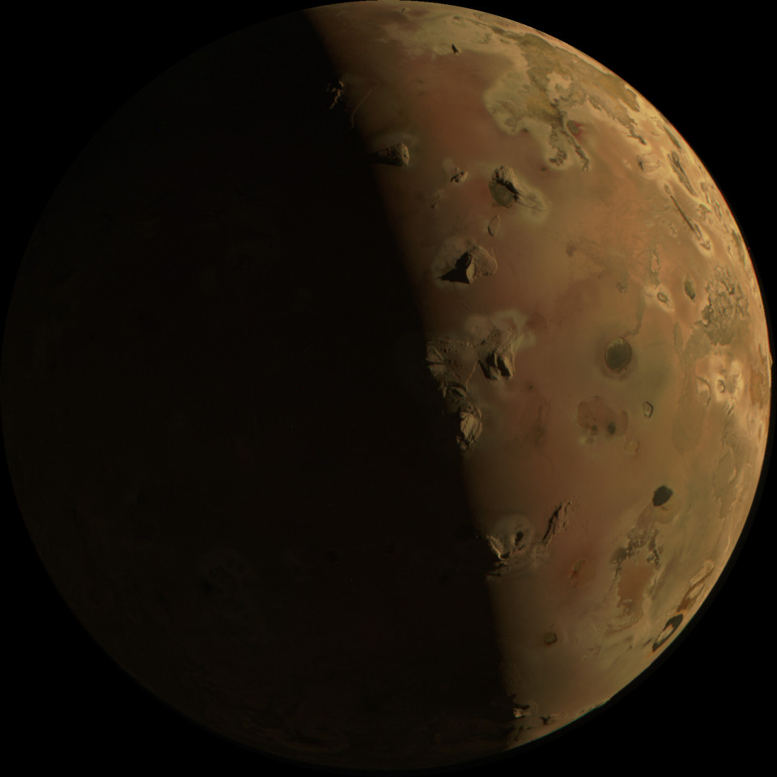
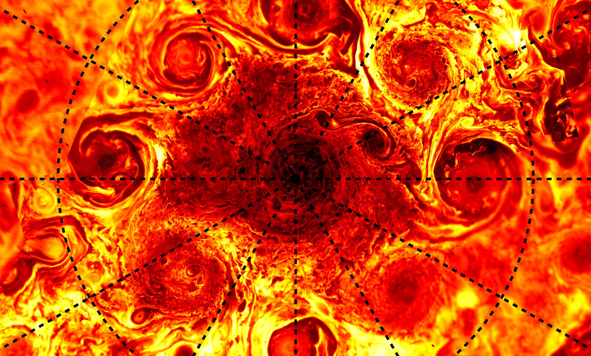
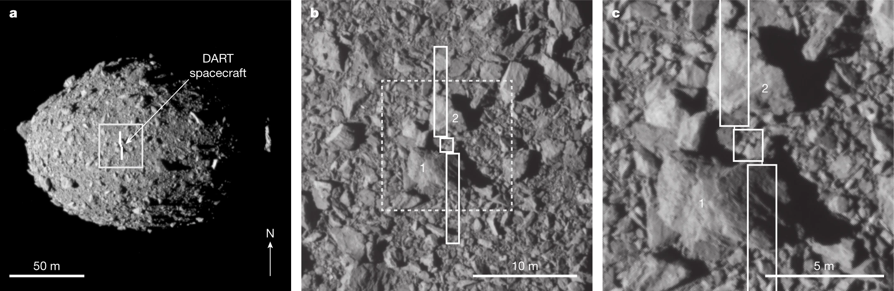

Projects
========

This is a collection of project ideas you can work on to practice your skills.
There are computer language and difficulty labels to help you find a project.
If you have your own idea for a project, feel free to contact me!

.. |fillstar| unicode:: U+2605
.. |openstar| unicode:: U+2606

.. |uncheckedbox| unicode:: U+2610
.. |checkedbox| unicode:: U+2611

1. JunoCAM observation of Io
----------------------------

:Contributor: **Trish Murray**

:Programming Language:
  ``Python`` [``Swift``]

:Difficulty:
  |fillstar| |fillstar| |fillstar| |fillstar| |openstar|

:Owner:
  **Macarena Peralta**

Background
~~~~~~~~~~

The trajectory of the Juno spacecraft was modified to visit the Galilean Moons. Its
instruments were designed to study the atmosphere of Jupiter, but as there are no other spacecraft nearby,
it’s the best one around!

On December 30, 2023, Juno was close to Io, Jupiter’s volcanic moon. The image that Junocam
collected was quickly processed to make projected maps in color and those were posted on the mission’s
public website. Here is one of those pictures:

The JunoCam instrument is a color camera that takes pictures in red, green, and blue filters.
The raw images are transmitted to Earth and are available for anyone to download and process.
The image above is a composite of 3 raw images, one for each color filter.
It is downloaded from the Juno mission website, under the 
`Image Processing <https://www.missionjuno.swri.edu/junocam/processing>`_ tab.
You can view the composite image in the browser 
`here <https://www.missionjuno.swri.edu/junocam/processing?id=JNCE_2023364_57C00022_V01>`_.
  

Basic Goal
~~~~~~~~~~

    Replicate the color picture from the raw images that the spacecraft transmitted.

Advanced Goal
~~~~~~~~~~~~~

    Build a new UI system for processing JunoCAM images using modern UI/UX design principles.

Quests
~~~~~~

    |uncheckedbox| Download the raw images from the Juno mission website.
        There are two important links on the Juno website and similar pages for other
        Junocam images: “Metadata and Images”, each of which downloads a zip file.
        We’ll address the Metadata link later, but download both now.

    |uncheckedbox| Understand the NAIF/SPICE system for spacecraft navigation.

    |uncheckedbox| Understand the spacecraft kernel files (SPK/CK/FK)

    |uncheckedbox| Use the SPICE kernels to determine the position of the spacecraft when the images were taken.

    |uncheckedbox| More quests to come!

Questions
~~~~~~~~~

    #. How close was Juno to Io?
    #. What is the resolution of the images?
    #. Why is half of Io brightly lit?
    #. Why is the dark half visible at all?

2. Microwave Mapping of Jupiter's Vortices
------------------------------------------

:Contributor: **Jiheng Hu**

:Programming Language:
  ``Python``

:Difficulty:
  |fillstar| |fillstar| |fillstar| |openstar| |openstar|

Background
~~~~~~~~~~
Jupiter is widely known for its global widespread storms, vortices, and convective clouds that dominate its upper atmosphere. These phenomena are closely linked to atmospheric dynamics and weather phenomenon.
Here is an infrared image of the Jupiter polar vortices, taken by Juno/JIRAM in the 20th flyby.

The Juno spacecraft is equipped with a microwave radiometer (MWR) capable of mapping Jupiter's atmosphere using six centimeter-wave channels, with frequencies ranging from 0.6 GHz (50 cm, channel 1) to 21.9 GHz (1.37 cm, channel 6) [1]_.
These channels are designed to detect the dynamic characteristics of Jupiter’s sub-cloud atmosphere and the presently unknown variations in the abundances of ammonia and water deep within these cloud decks.
During the 19-th flyby, the MWR observed several Jovian vortices in the mid-latitudes [2]_.
Recent flybys have revealed features of the polar vortices.

  
Basic Goal
~~~~~~~~~~

    #. Make plots of the multiband microwave brightness temperature signals observed by Juno/MWR
    #. Map and identify individual Jovian vortices.

Advanced Goal
~~~~~~~~~~~~~

    #. Read the numerical simulation results of Jovian vortices.

    #. Simulate the synthetic MWR antenna temperatures of the Jovian vortices.
           A synthetic MWR antenna temperature is obtained by the integration of point-wise emission model with 
           the MWR's measurement response function (MRF). To perform the integration, we need to know
           the antenna pattern function, the spacecraft's altitude, and the antenna beamwidth.

Quests
~~~~~~

   |uncheckedbox| Login into a Linux workstation and find the Juno MWR observation file (HDF).

   |uncheckedbox| Understand the structure of the HDF file and the meaning of each variable.

   |uncheckedbox| Understand how the Juno/MWR makes observations of Jupiter (a spinning mapping mode).

   |uncheckedbox| Extract variables from the HDF file, understand the meaning of footprints and the spacecraft trajectory.

   |uncheckedbox| Explain how the footprint forms in the context of a spinning maping mode.

   |uncheckedbox| More quests to come!

Questions
~~~~~~~~~

    #. What are the feature(s) of Jovian vortices in the MWR images?
    #. Amongst the images of six MWR channels, which one gives the clearest featrues of vortices, why?  
    #. What is the resolation of an MWR-mapped image?
    #. Why is a typical MWR footprint an elliptical shape?
    #. How to calculate an effective emission angle given the MWR's poistion and altitude?  

References
~~~~~~~~~~

.. [1] Janssen, M.A. et al. MWR: Microwave Radiometer for the Juno Mission to Jupiter. *Space Science Review* 213, 139–185 (2017).
   https://doi.org/10.1007/s11214-017-0349-5.  

.. [2] S.J. Bolton et al. Microwave Observations Reveal the Deep Extent and Structure of Jupiter’s Atmospheric Vortices. *Science* 374, 968-972(2021).
   http://doi.org/10.1126/science.abf1015.  

3. DART DRACO observation of Didymos-Dimorphos binary asteroid system
---------------------------------------------------------------------

:Contributor: **Yun Zhang**

:Programming Language:
  ``Python`` [``Matlab``] 

:Optional software:
  ``ArcGIS``

:Difficulty:
  |fillstar| |fillstar| |fillstar| |fillstar| |openstar|

Background
~~~~~~~~~~

The Double Asteroid Redirection Test (DART) mission is the first mission to test the kinetic impactor 
technique to redirect asteroids and mitigate potential threats. Targeting the Didymos-Dimorphos binary system, 
the DART spacecraft collided with the moonlet Dimorphos on 26 September 2022 at a speed of about 6 km/s.

The spacecraft carried the Didymos Reconnaissance and Asteroid Camera for Optical Navigation (DRACO), a 
narrow-angle imager used for optical navigation, terminal guidance, and asteroid characterization. As it 
approached Dimorphos, the spacecraft continuously transmitted images to the ground until 0.855 s before impact, 
revealing a boulder-rich surface. All the raw and calibrated images, Dimorphos's shape model, as well as 
associated documentation can be downloaded from `PDS Small Bodies Node <https://pds-smallbodies.astro.umd.edu/data_sb/missions/dart/index.shtml>`_. 
An example is shown below (from an image captured 12.409 s before impact).

As the morphology and size distribution of the boulder field on Dimorphos have significant implications for the asteroid's formation and evolution, let's proceed to analyze the images to extract this information!

Basic Goal
~~~~~~~~~~

    Develop an image processing pipeline for extracting 2D boulder shape information from images.

Advanced Goal
~~~~~~~~~~~~~

    Design and train a machine-learning model to automatic characterization of boulder shape and size distribution.

Quests
~~~~~~

    |uncheckedbox| Download the calibrated images from the DART mission data website at PDS.

    |uncheckedbox| Understand the FITS Data Format and learn to view and manipulate FITS images.

    |uncheckedbox| Determine the pixel scale of the selected to-be-analyzed images 
         hint: find the spacecraft range according to the known time of impact and spacecraft speed or use the shape models.

    |uncheckedbox| Prepare the training set by manual and automated mapping of boulders' shape from images 
         Typically, a boulder requires a minimum of 3–5 pixels for accurate identification.

    |uncheckedbox| More quests to come!

Questions
~~~~~~~~~

    #. How large is the largest boulder on Dimorphos?
    #. What is the resolution of the final image received on the ground?
    #. Why does the shape model of Dimorphos appear more oblate than the illuminated limb shown in the image?
    #. How are boulder sizes distributed on Dimorphos?
